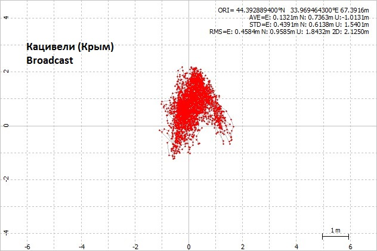
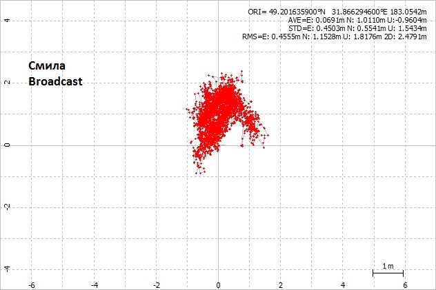
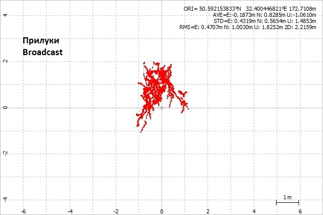
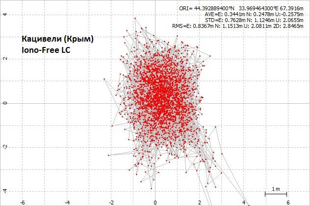
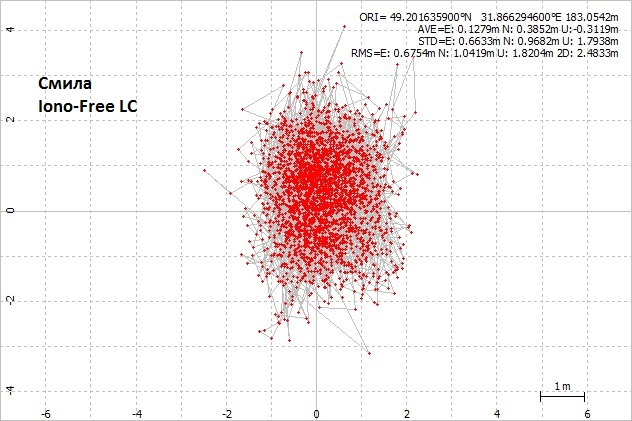
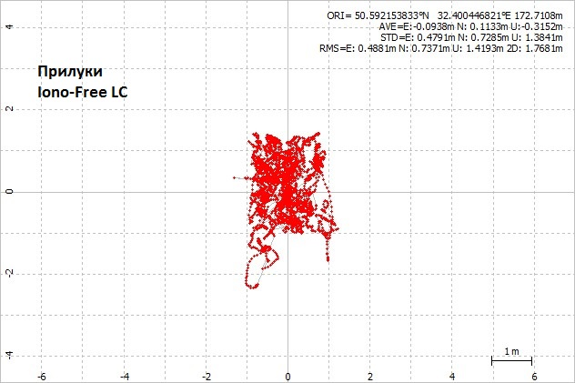

# RTKPOST-and-GPS
Экспериментальное исследование точности  GPS при использовании RTKPOST   в зависимости от  ионосферы

С ftp://ftp.mao.kiev.ua/pub/gnss/data/CRINEX_30s/2020/227/ используются файлы наблюдений за сутки

SMLA2270.20D  [Смила](https://gnss.mao.kiev.ua/?q=node/14)

PRYL2270.20D  [Прилуки](https://gnss.mao.kiev.ua/?q=node/110)

KTVL2270.20D  [Кацивели](https://gnss.mao.kiev.ua/?q=node/15) (Крым)

Еще для постобработки GPS суточных двухчастотных наблюдений в RTKPOST используем файлы brdc2270.20n igs21185.sp3 igs21185.clk_30s igsg2270.20i . Используем режим Single
с параметрами Saastamoinen, Precise изменяя только Broadcast или Iono-Free LC для всех трех GNSS станций разнесенных на приличное расстояние и использующих различное оборудование.
Какое именно конкретно оборудование используется в каждом населенном пункте можно посмотреть по ссылкам приведенныи выше.

### Выводы.
1. Даже при суточных наблюдениях, неподвижный одночастотний приемник в идеальных условиях приема, в режиме Single и Broadcast получить абсолютные координаты невозможно.
2. Включать в духчастотнике  Iono-Free LC при использовании приемника при перемещениях лишено смысла, ошибка будет только больше.

### License

Copyright &copy; 2020 IvanKor
Distributed under the [MIT License](http://www.opensource.org/licenses/mit-license.php).
